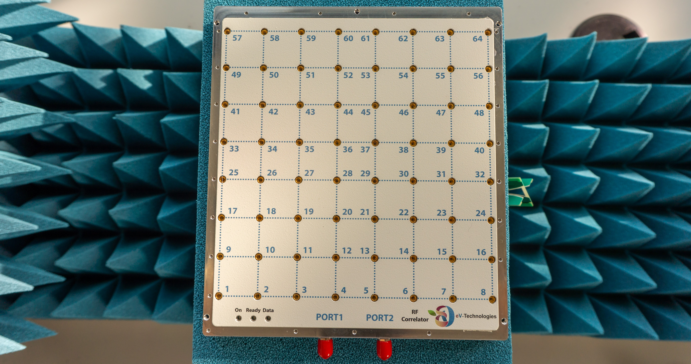

# eV-Technologies 64 ports correlators

> 10MHz-30GHz and 10MHz-10GHz 2x64 Port Solid-State mmWave and RF Crossover Switchs

<a href="https://ev-technologies.com/">

## Description

### EVT3064 mmWave Correlator

The *EVT-3064* is a fast mmWave-Correlator with USB controlled crossover switch-matrix that can switch any of **two common ports** to any of **64 input/output ports**.
It features a **full crossover capability** allowing any switching combination to be selected, while supporting **bi-directional** RF paths from 16 kHz to 30 GHz with **low insertion loss**. Each port is DC blocked and can withstand up to 16V.
Unlike mechanical switches, each port is always internally matched to **50 Ohm** and the unselected ports are internally matched making this perfect as a VNA extender.The module features an internal oven and can if required hold stability over time to less than 0.02dB with zero drift and near perfect repeatability due to solid-state technology.
The EVT3064 is configured with 2.92mm common ports and SMPM switched ports. Different connector types may be provided upon request. The EVT3064 is suitable for automated test and may be controlled via USB.
Predefined sequences can be loaded in and triggered by input and output TTL logic signals. This can allow ultra-fast switch sequences of micro-second timing to be achieved.
The use of the oven requires an additional power supply, but the module can run from USB alone if the increased long-term temperature stability is not required.
The switching speed with USB is dependent on the host computer. The EVT3064 switching may settle within 10us. However, when the switching is driven by a host PC may, this is typically slowed down to 1ms. If faster speeds are required, a pre-determined sequence can be loaded in and TTL triggering can be used to sweep through the switching sequence.

### EVT1064 RF Correlator

The *EVT-1064* is a fast RF Correlator with USB controlled crossover switch-matrix that can switch any of **two common ports** to any of **64 input/output ports**.

The features are the same as the EVT3064 but in the 10MHz - 10GHz frequencies bands

## Control options

- USB connection to control the correlator, connect as a serial port
- Can be controlled with LabVIEW, Matlab, C, Python, etc…

## How to use

1. Connect the correlator to a computer via the mini-USB port

2. Open a terminal with the following parameters (we recommand [*Termite*](https://www.compuphase.com/software_termite.htm))
    - COM Port: choose the correct one
    - Baudrate: 100000
    - Data bits: 8
    - Stop bits: 1
    - Parity: None
    - Flow Control: None
3. Send the desired command *

\* *If the command was received correctly the symbol 'O' is returned*

## Usable commands

The commands are usable with both EVT3064 and EVT1064

To change the connection of any port:

'SXYY' where X is the common port (1 or 2) and YY the input/output port you need (from 01 to 64). It is important to send the command with 2 digits.

Example commands:

`S101` Assign common port 1 to input/output port 1

`S163` Assign common port 1 to input/output port 63

`S202` Assign common port 2 to input/output port 2

`S264` Assign common port 2 to input/output port 64

## What's in this repository ?

In `examples/Python` you will find example code to use the correlators with python code.
No special library is required.

## About us

For any information please visit our website : [eV-Technologies](https://ev-technologies.com/)
